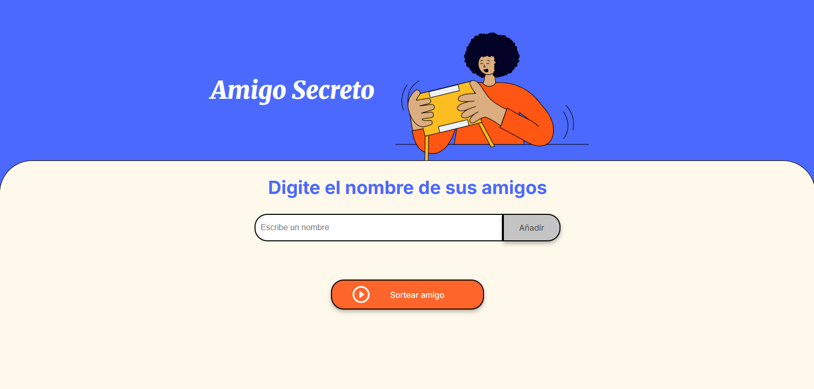

# 🎁 Juego de Amigo Secreto

---

## 📑 Índice

- [🎯 Descripción del Proyecto](#-descripción-del-proyecto)
- [📌 Estado del Proyecto](#-estado-del-proyecto)
- [🧪 Demostración](#-demostración-de-funciones-y-aplicaciones)
- [🚪 Acceso al Proyecto](#-acceso-al-proyecto)
- [🛠️ Tecnologías Utilizadas](#-tecnologías-utilizadas)
- [🤝 Personas Contribuyentes](#-personas-contribuyentes)
- [👨‍💻 Desarrolladores del Proyecto](#-personas-desarrolladoras-del-proyecto)
- [📝 Licencia](#-licencia)

---

## 🎯 Descripción del Proyecto

El **Juego de Amigo Secreto** es una aplicación web simple en la que el usuario puede ingresar, a través de un input, el nombre de un amigo que irá añadiendo a una lista a través del botón **"Añadir"** . Al hacer clic en el botón **"Sortear amigo"**, el programa elige aleatoriamente uno de los nombres ingresados y lo muestra en pantalla como el "amigo sorteado".

Este proyecto tiene como objetivo entretener y facilitar el sorteo en actividades grupales o celebraciones.

---

## 📌 Estado del Proyecto

🚧 Proyecto en desarrollo: pausado  
✔️ Versión de prueba funcional: completa  
🔜 Ideas de próximas mejoras: fixear validación de nombres, ranking, animaciones, historial de sorteos, 2do y 3er puesto

---

## 🧪 Demostración de funciones y aplicaciones

### Funcionalidades:

- ➕ Agregar nombre a una lista a través del botón "Añadir"
- 📋 Presentar lista de nombres
- 🎲 Sorteo aleatorio al presionar el botón "Sortear Amigo"
- 👀 Visualización inmediata del nombre sorteado
- 🔁 Rejugable

---

## 🚪 Acceso al Proyecto

Podés acceder al proyecto desde este repositorio o verlo online:

🔗 [Ver proyecto en GitHub Pages](https://ebudy0410.github.io/challenge-amigo-secreto/)

---

## 🛠️ Tecnologías Utilizadas

- HTML5
- CSS3
- JavaScript

---

## 🤝 Personas Contribuyentes

Agradecemos a quienes colaboraron en pruebas, ideas y mejoras:

- 🙋‍♀️ [Vicente Saa](https://github.com/ebudy0410)
- 🏘️ [Alura Latam](https://github.com/alura-es-cursos)

---

## 👨‍💻 Personas Desarrolladoras del Proyecto

- 👨‍💻 [Vicente Saa](https://github.com/tucuenta) – Lógica de programación, funcionalidad del sorteo
- 👨‍💻 [Alura Latam](https://github.com/alura-es-cursos) - Desarrollo Frontend estático y estructural

---

## 📝 Licencia

Este proyecto NO está bajo la licencia y su uso es LIBRE.

---

